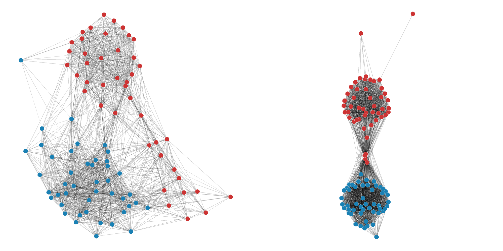

# Congressional Voting Networks

Networks of voting similarity for U.S. House and Senate for each session of Congress  
*(Pictured above are the 70th (left) and 110th (right) Senate.)*

## Sources

This analysis was originally perfomed in:

> The Rise of Partisanship and Super-Cooperators in the U.S. House of Representatives
Andris C, Lee D, Hamilton MJ, Martino M, Gunning CE, et al. (2015) The Rise of Partisanship and Super-Cooperators in the U.S. House of Representatives. PLOS ONE 10(4): e0123507. https://doi.org/10.1371/journal.pone.0123507

The data comes from voteview.com:

> Lewis, Jeffrey B., Keith Poole, Howard Rosenthal, Adam Boche, Aaron Rudkin, and Luke Sonnet (2020). Voteview: Congressional Roll-Call Votes Database. https://voteview.com/ 

## How to Run

First, you need to acquire four files from voteview:

- Member Ideology (House, All Congresses, CSV), `Hall_votes.csv`
- Members' Votes (House, All Congresses, CSV), `Hall_members.csv`
- Member Ideology (Senate, All Congresses, CSV), `Sall_votes.csv`
- Members' Votes (Senate, All Congresses, CSV), `Sall_members.csv`

Update `agreements.py` to reference the votes CSV that you wish to tally. This will produce a tab-delimited file that shows the number of agreements (if >0) between any pair of congressmen across every congressional session. The House takes longer to run than the Senate and benefits from running over multiple cores.

Next, to find the vote thresholds, use `thresholds.R` to combine the pairwise data from `agreements.tsv` with the member ideology data you've downloaded. Again, update file paths as necessary for House vs. Senate.

Finally, we have the data we need to construct networks. Use `networkize.R` to finish the job, updating paths as appropriate.

### Seriously, I have to update paths and stuff?

Yes. This code was intended to be run in an ad hoc/one-off fashion, and I originally only cared about the House. Later I decided to do the Senate as well. At that point, it was run in a *two-off* fashion. It's not perfect, but it's something.

### Dependencies

- Python (tested on 3.6)
- R (tested on 4.0)
    - `network`
    - `tidyverse`
